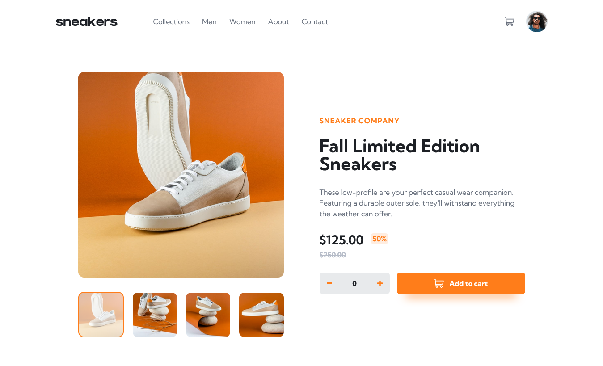

# Frontend Mentor - E-commerce product page solution

This is a solution to the [E-commerce product page challenge on Frontend Mentor](https://www.frontendmentor.io/challenges/ecommerce-product-page-UPsZ9MJp6). Frontend Mentor challenges help you improve your coding skills by building realistic projects.

## Table of contents

- [Overview](#overview)
  - [The challenge](#the-challenge)
  - [Screenshot](#screenshot)
  - [Links](#links)
- [My process](#my-process)
  - [Built with](#built-with)
  - [What I learned](#what-i-learned)
  - [Continued development](#continued-development)
  - [Useful resources](#useful-resources)
- [Author](#author)

## Overview

### The challenge

Users should be able to:

- View the optimal layout for the site depending on their device's screen size
- See hover states for all interactive elements on the page
- Open a lightbox gallery by clicking on the large product image
- Switch the large product image by clicking on the small thumbnail images
- Add items to the cart
- View the cart and remove items from it

### Screenshot

### Links

- Solution URL: [Github](https://github.com/arey-dev/ecommerce-product-page)
- Live Site URL: [Ecommerce-Product-Page](https://arey-dev.github.io/ecommerce-product-page/)

## My process

### Built with

- Semantic HTML5 markup
- Flexbox
- CSS Grid
- [React](https://reactjs.org/) - JS library
- [Styled Components](https://styled-components.com/) - For styles

### What I learned

In this project, I used `Styled Components` to style the project. It was overwhelming at first and I didn't know how to structure my styled components. I enjoyed using `Styled Components` because it can be flexbile.

### Continued development

In my following projects, I want to use more of react advance concepts, get to know it more and be comfotable with it.

### Useful resources

- [styled-components](https://styled-components.com/) - this documentation of styled-components helped me a lot and I will plan to use it more in my following projects

## Author

- Frontend Mentor - [@are-dev](https://www.frontendmentor.io/profile/arey-dev)
